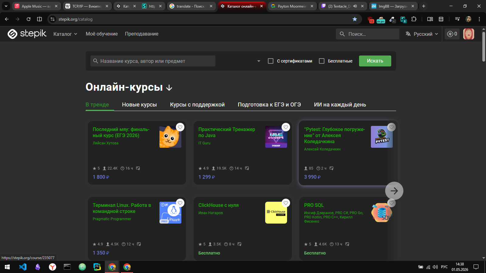

# стили на степик

[link on the style](https://userstyles.world/style/27896)

[donat](https://www.donationalerts.com/r/typeerror)

# notes
## сократить количество строк кода
сократил, перенёс повторяющееся стили классов и тегов в общие стили для всех stepik страниц
надо будет еще поискать и по переносить.

## изменить цвет текста в блоке с авторами курсов
на данный момент он чёрный(04.05.2026 14:37)

<<<<<<< HEAD
## после нажатия на кнопку поиска. под карточками курсов есть светлая линия, надо убрать
=======
## после нажатия на кнопку поиска. под карточками курсов есть сыетлая линия, надо убрать
>>>>>>> fdb375516b656de2527a91416d9c39aba8ae814a

# сделать стили на оставшееся страницы stepik.
сейчас сделано только на каталог и не много на поиск(03.05.2026 15:20)